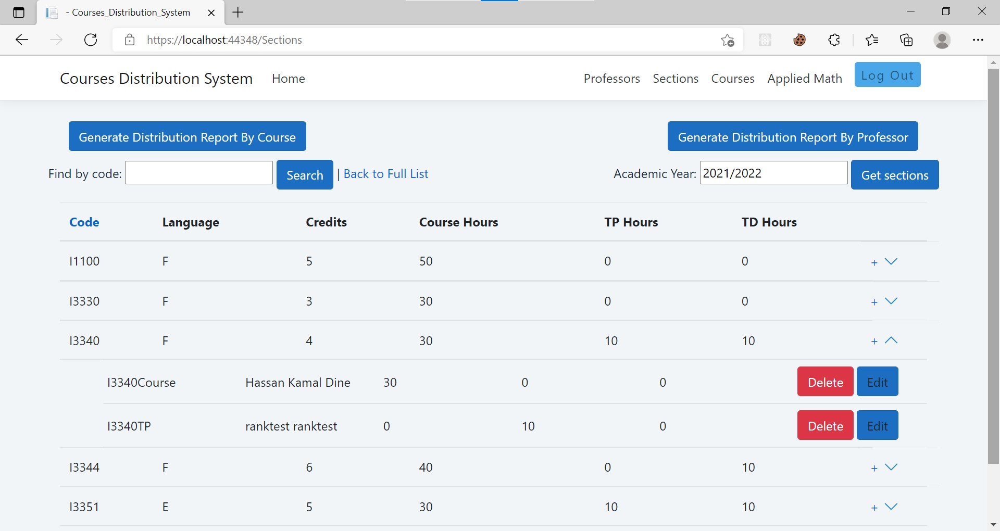

# Courses-Distribution-System
An ASP .NET web based system for courses distribution, used by the heads of departments at the Lebanese university faculty of sciences, to help manage information about the courses and professors in their respective departments, and to distribute courses to the professors.  
This app was developped as a part of my senior year project, I used ASP .Net core razor pages with a MSSQL-server databaseand the entity framework ORM.
## How it works
The user can login as an admin or a head of department:(cookie based authentication)

The admin is authorized to manage the accounts of heads of departments.  
The head of department is authorized to manage courses, professors and ditribution of courses on professors of their respective departments.

